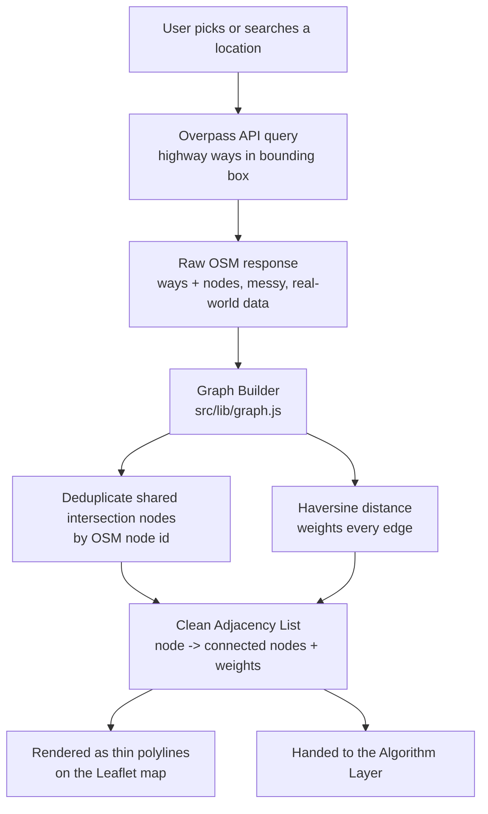
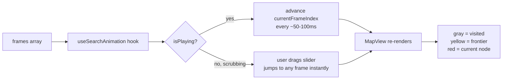

# ⚡ DoratriX — Architecture

> How a click on a map turns into a search through a city's soul.

This document walks through **how DoratriX actually thinks** — from the moment OpenStreetMap data lands in the browser, to the moment a red node lights up and says "found it."

---

## 🗺️ The Big Picture

Think of DoratriX as three layers stacked on top of each other, each one dumber and more honest than the one above it:

```
┌─────────────────────────────────────────────┐
│  🎨 PRESENTATION LAYER                        │
│  React components, Leaflet map, buttons,     │
│  sliders, the stuff a human actually touches │
└───────────────────┬───────────────────────────┘
                     │
┌────────────────────▼──────────────────────────┐
│  🧠 ALGORITHM LAYER                            │
│  Dijkstra, A*, hand-written, no shortcuts,    │
│  the actual "brain" of the whole project      │
└────────────────────┬──────────────────────────┘
                      │
┌─────────────────────▼───────────────────────────┐
│  🕸️ DATA LAYER                                  │
│  Raw OpenStreetMap chaos, tamed into a clean    │
│  graph of nodes and weighted edges              │
└───────────────────────────────────────────────────┘
```

No backend. No database. No server quietly doing work you can't see. Everything above happens **live, in one browser tab**, which is either delightfully minimal or slightly unhinged, depending on your mood.

---

## 🧬 The Data Pipeline — From City to Graph

This is the part nobody sees, and the part where most of the actual bugs live.



**The one rule that matters most here:** an intersection where three roads meet must become **one shared node**, not three near-identical strangers who happen to live at the same coordinates. Get this wrong, and Dijkstra will confidently route you around a lake instead of through the obvious street sitting right there. (Ask us how we know.)

---

## 🧠 The Algorithm Layer — Where the Actual Thinking Happens

Two algorithms live here, side by side, like rival detectives solving the same case with different instincts.

```
graph.js  ──┐
            ├──▶  dijkstra.js  ──▶  { path, distance, frames }
            └──▶  astar.js     ──▶  { path, distance, frames }
```

**Dijkstra** — methodical, exhaustive, trusts nothing, checks everything nearby before committing. Guaranteed correct, occasionally a little slow about it.

**A\*** — same core logic, but with a hunch. It uses straight-line (haversine) distance to the destination as a heuristic, letting it lean toward the goal instead of fanning out blindly. Same guaranteed-correct answer, usually with far fewer nodes explored.

Both algorithms don't just return an answer — they **narrate their own thought process**. Every time a node gets pulled off the priority queue, a `frame` is recorded:

```js
{
  currentNode: "n482",
  frontier: ["n483", "n501", "n512", ...],
  visited: ["n201", "n305", "n410", ...]
}
```

That array of frames is the raw material for everything visual that happens next.

---

## 🎬 The Animation Layer — Turning Frames Into a Show



This is the single most important piece of UX in the whole project — it's the difference between "a website that computes a route" and "a website where you *watch a mind work*." The hook doesn't know or care whether the frames came from Dijkstra or A* — it just plays back whatever array it's handed, which is exactly why Compare Mode works: run both, animate both, let the viewer feel the difference in real time instead of reading it off a stat sheet.

---

## 🖥️ Component Map

```
App.jsx
 └── MapView.jsx            ← the stage where everything performs
      ├── TileLayer          (Leaflet base map)
      ├── Polyline (network)  (the full road graph, drawn faint)
      ├── Polyline (path)     (the bold final answer)
      ├── CircleMarkers        (visited / frontier / current — the animation)
      ├── Marker (start)        🟢
      └── Marker (end)           🔴

 └── ControlPanel.jsx         ← the cockpit
      ├── Clear Points
      ├── Debug Mode toggle
      ├── Algorithm selector (Dijkstra / A* / Compare)
      ├── Distance readout
      ├── Play / Pause / Reset
      └── Step slider

 └── SearchBar.jsx            ← the "type instead of click" shortcut
      └── calls Nominatim → findNearestNode() → same pipeline as a click

lib/
 ├── graph.js       ← Overpass fetch, parsing, haversine, findNearestNode
 ├── dijkstra.js    ← the methodical detective
 └── astar.js       ← the detective with a hunch

hooks/
 └── useSearchAnimation.js   ← the projectionist running the film
```

---

## 🔄 The Full Journey of a Single Click

To tie it all together, here's what happens the instant a user clicks the map, start to finish:

1. **Click registered** on the Leaflet map → raw lat/lng captured
2. `findNearestNode()` snaps that click to the closest real node in the graph (a road, not empty space)
3. State updates → a green or red `Marker` appears at the snapped location
4. User clicks **"Find Path"** → both `dijkstra()` and `astar()` (or just one, depending on mode) run against the graph, each returning `{ path, distance, frames }`
5. `useSearchAnimation` takes the frames and starts playback
6. Every ~50-100ms, the map repaints: another ring of gray "visited" dots, a shifting yellow frontier, a red node hopping forward
7. Animation completes → the bold blue path animates in, tracing the final answer along real streets
8. Stats panel updates: distance, nodes explored, time taken — the epilogue to the story that just played out

---

## 🚧 Why No Backend (Yet)

Everything above runs **entirely in the browser** — no server, no database, no API key beyond what's needed for free public services (Overpass, Nominatim). This was a deliberate choice, not a limitation:

- **Faster to build and debug** — see results instantly, no deploy step between "change code" and "see if it worked"
- **Zero hosting cost or complexity** — the whole thing ships as a static site
- **Forces the algorithm work to stay honest** — there's no server quietly doing the hard part; if it works, it's because the client-side code actually works

The planned evolution — a Python/FastAPI backend running the graph-building and algorithms server-side — is a deliberate **v2**, not a missing piece of v1. It'll unlock caching, larger cities, and genuine full-stack architecture, once the core logic (already proven out here) is ready to be relocated rather than rewritten under pressure.

---

## 🧭 Design Principles, In Short

- **Show the work, not just the answer.** Every architectural decision serves the animation — that's the whole soul of this project.
- **No black boxes where it matters.** The graph is built by hand. The algorithms are written by hand. If it's the point of the project, it's not outsourced to a library.
- **Free, open, and portable.** OpenStreetMap over Google Maps. Leaflet over a paid SDK. No API key should ever be a reason this project can't run.
- **Client-side first, server-side when it's earned.** Complexity gets added when the project actually needs it, not because "real apps have backends."

---

**This is the map behind the map — the part nobody clicks on, but the part that makes the clicking mean something.**
