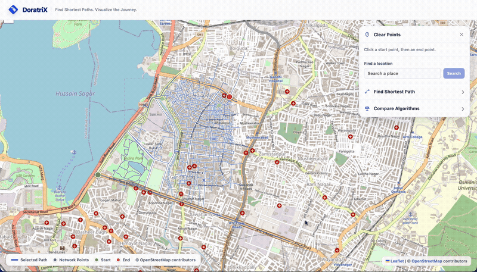
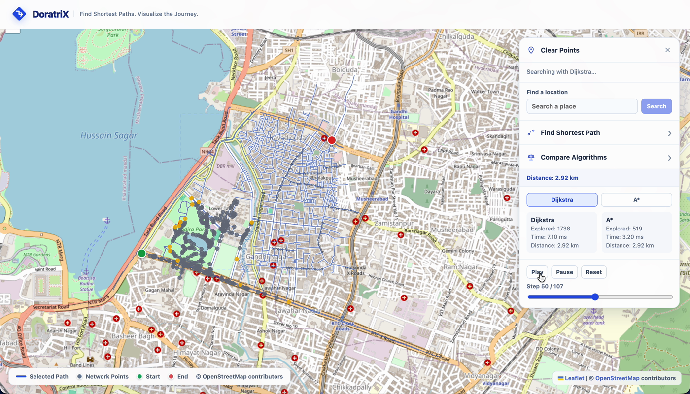

# ⚡ DoratriX

### *Find Shortest Paths. Visualize the Journey.*

**[🔴 Live Demo →](https://doratri-34jva1302-sunnyboi0010-6275s-projects.vercel.app/)**
---



---

Every other routing app on the planet treats "how do I get there" as a magic trick performed behind a curtain. You tap two pins, a blue line materializes, the end. Google Maps has never once shown you *how* it found that route, and frankly, it never will — that's a trade secret worth billions.

DoratriX rips the curtain down.

This is a **from-scratch pathfinding visualizer** that runs Dijkstra's algorithm and A* — hand-written, no shortcuts, no `npm install shortest-path` — directly on **real road data** pulled live from OpenStreetMap. And instead of just handing you an answer, it lets you **watch the algorithm think**: nodes lighting up wave by wave, a frontier expanding outward, until it finally taps the destination and says *"got it."*

Then, because one algorithm racing itself is boring, it runs **A\*** on the exact same problem and lets you watch it find the *same* correct answer while exploring a fraction of the map — turning "Big-O notation" from a whiteboard concept into something you can literally watch happen in front of you.

---

## 🤔 "Okay but... Google Maps already does this?"

Google Maps gives you an *answer*. DoratriX gives you the *interrogation*.

| | Google Maps | DoratriX |
|---|---|---|
| Shows you the final route | ✅ | ✅ |
| Shows you the algorithm actually *searching* for it | ❌ (trade secret) | ✅ (the whole point) |
| Lets two algorithms race each other on your screen | ❌ | ✅ |
| Built by you, from scratch, as a learning project | ❌ (billion-dollar company did it) | ✅ |
| Requires a credit card to enable | 😬 sometimes | ❌ never |

We are not trying to dethrone Google. We're trying to show you the machine room they'll never let you tour.

---

## 🎬 See It In Action

Watch the panel on the right: **Dijkstra explores 1,738 nodes. A\* explores 519.** Same destination. Same correct 2.92 km answer. Wildly different amount of effort.



That's not a mocked-up stat for marketing purposes — that's a real search, on a real street network, with the receipts to prove A* isn't just hype.

---

## ✨ Features

- 🗺️ **Real road networks** — pulled live from OpenStreetMap via the Overpass API, for any location you search
- 🧮 **Dijkstra's algorithm**, implemented by hand, with a proper binary-heap priority queue (not the "linear scan and pray" version)
- ⭐ **A\* algorithm**, also hand-written, using straight-line distance as a heuristic to skip the busywork
- 🎬 **Step-by-step search animation** — visited nodes, the active frontier, and the current node, all color-coded, with full Play / Pause / Reset / Scrub controls
- ⚔️ **Compare Mode** — race Dijkstra against A* on the same start/end pair and watch the efficiency gap happen in real time, not just read about it in a textbook
- 📍 **Click, drag, or search** to set your start and end points — no rigid "click twice and hope" flow, everything is adjustable
- 🔍 **Location search** powered by Nominatim — type a place name instead of hunting for it on the map
- 🐛 **Debug tooling** for diagnosing graph connectivity issues (gated behind `?debug=true`, because regular visitors don't need to see our dirty laundry)
- 📱 **Responsive** — works on a laptop, a tablet, or your phone while you're avoiding actual work

---

## 🛠️ How It's Built

**Frontend:** React (Vite) · Leaflet + react-leaflet
**Map & road data:** OpenStreetMap · Overpass API · Nominatim (search)
**The actual brains:** Hand-rolled Dijkstra & A*, running 100% client-side, in your browser, right now
**Hosting:** Vercel — zero backend, zero database, zero server quietly doing the hard part while you take credit for it

No API keys. No billing accounts. No "enter your credit card to continue" walls. Every service this project touches is free and open, on purpose.

---

## 🧠 How It Actually Works (The Short Version)

1. **You pick a spot** → DoratriX asks OpenStreetMap for every road within a small radius
2. **The chaos gets tamed** → raw map data becomes a clean graph: intersections become nodes, streets become weighted edges, and a "largest connected component" filter quietly deletes any road fragments that only *look* connected but secretly aren't (ask us how we found that bug)
3. **You click twice (or search twice, or drag things around like a raccoon rearranging its found treasures)** → start and end points snap onto the nearest real road
4. **You hit "Find Path" or "Compare Algorithms"** → the algorithm(s) run, quietly recording every single step of their search into an array of "frames"
5. **The animation plays** → those frames get replayed on screen, turning cold algorithmic logic into something that looks alive
6. **The final path draws in** → a bold line tracing the actual streets, because at the end of the day, yes, it does still need to just tell you where to go

Want the deep-dive, file-by-file breakdown with actual code excerpts? Check `ARCHITECTURE.md` and the full PDF documentation in this repo — we over-documented this thing on purpose.

---

## 🚀 Running It Yourself

```bash
git clone <this-repo-url>
cd practice123
npm install
npm run dev
```

Open the local URL it gives you (usually `http://localhost:5173`), and you're in business. No `.env` file, no API keys to hunt down, no billing setup. Click the map, hit Play, and watch a search algorithm do its thing.

To build for production:

```bash
npm run build
```

---

## 🗺️ Project Documentation

This repo comes a little over-prepared, on purpose:

- 📘 `PRD.md` — the pitch, the vision, the "why does this exist"
- 🏗️ `ARCHITECTURE.md` — the technical deep-dive, with diagrams
- ✅ `TASKS.md` — the full build log, phase by phase, warts and all
- 📄 `DoratriX_Documentation.pdf` — file-by-file code walkthrough with real excerpts

---

## 🔮 What's Next

- 🌐 Fully dynamic search — right now the graph loads around one area; search-anywhere with live re-fetching is in progress
- 🎛️ Custom cost functions — avoid a road, minimize turns, optimize for whatever *you* care about, not what Google decided for you
- 🛰️ Satellite view toggle
- 🌍 Multi-language support
- 🐍 A Python/FastAPI backend migration, for when this outgrows "runs entirely in one browser tab"

---

## 🙏 Built On the Shoulders Of

- [OpenStreetMap](https://www.openstreetmap.org/copyright) contributors — the actual heroes who mapped every one of these streets for free
- [Overpass API](https://overpass-api.de/) — for handing that data over on request
- [Nominatim](https://nominatim.org/) — for turning "Indira Park" into coordinates a computer can understand
- [Leaflet](https://leafletjs.com/) — for making maps in a browser not feel like a nightmare

---

**No black boxes. No billing walls. Just an algorithm, a real city, and a front-row seat to watch it think.**
